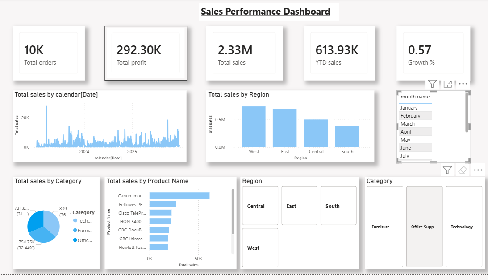

Sales Performance Dashboard (Power BI)

 Overview

This project is a Sales Performance Dashboard built using Power BI to analyze business metrics like revenue, profit, and growth trends.

 Key Features
 
KPI Cards: Total Orders, Total Sales, Profit, YTD Sales, Growth %
Monthly Sales Trend Analysis
Sales by Region and Category
Top Products Analysis
Interactive Slicers (Region, Category, Month)

 DAX Measures Used
 
Total Sales
Previous Month Sales
Growth %
YTD Sales
Total Orders

 Tools Used
 
Power BI
DAX
Data Modeling (Calendar Table)

 Key Insights
 
Highest sales region: West
Sales growth trend analyzed month-wise
Category-wise performance comparison
Top-performing products identified
 Dashboard Preview

Dashboard Preview

 Author

Hera Khan
